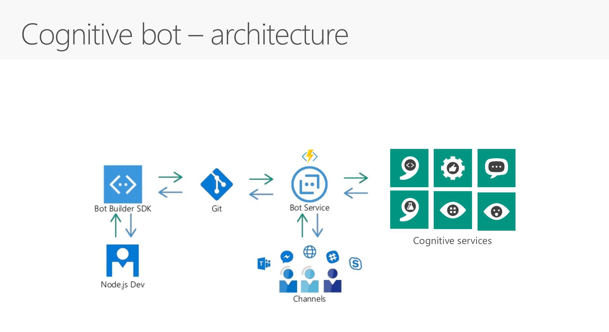

Cognitive bot demo 
==================
# Git commit and push 1

This code generated backend for cognitive bot demo based on Azure Bot Service.
It uses Microsoft Cognitive Services like:
1. [Face API](https://azure.microsoft.com/en-us/services/cognitive-services/face/) - face detection and identification
2. [Text Analytics API](https://azure.microsoft.com/en-us/services/cognitive-services/text-analytics/) - languade detection
3. [Translator Text API](https://azure.microsoft.com/en-us/services/cognitive-services/translator-text-api/) - translate text from detected language to english
4. [Computer Vision API](https://azure.microsoft.com/en-us/services/cognitive-services/computer-vision/) - image description and OCR

Architecure
-----------



Setup
-----
1. Create a resource group on azure
2. Create all four cognitive services listed above, copy their endpoints url and primary keys.


3. Create storage account with two blob containers to hold allowed person photos for training ("faces" container) and incomming photos for identification ("facetodetect" container)


4. Teach your face API about your authorized persons by creating a new gorup,  persons, upload persons faces and train the model. you can use directly from the [Face API](https://azure.microsoft.com/en-us/services/cognitive-services/face/) website or with [Microsoft Intelligent Kiosk](https://www.microsoft.com/en-gb/store/p/intelligent-kiosk/9nblggh5qd84?rtc=1).
save the group id, you'll need it later for configuring the bot.


4. Create bot service based on node js code


5. Clone this repo locally
6. Create environment variables (I recommend to use [vscode](https://code.visualstudio.com/download) just edit .vscode/launch.json file)
```
"MicrosoftAppId"
"MicrosoftAppPassword"
"APPINSIGHTS_INSTRUMENTATIONKEY"

"TEXT_ANALYTICS_KEY"
"TRANSLATE_KEY"
"COMPUTER_VISION_KEY"
"FACE_KEY"

"TEXT_ANALYTICS_API_ENDPOINT"
"TRANSLATE_API_ENDPOINT"
"COMPUTER_VISION_API_ENDPOINT"
"FACE_API_ENDPOINT"

"AZURE_STORAGE_ACCOUNT"
"AZURE_STORAGE_ACCESS_KEY"
"AZURE_STORAGE_CONNECTION_STRING"

"PERSON_GROUP_ID"
```
7. Test your bot locally using [bot framework emulator](https://docs.microsoft.com/en-us/bot-framework/debug-bots-emulator)


8. Setup continuous integration from your git repo to the bot service
9. Configure the same environment variable (listed above) as Application settings in the bot service.
10. Test your bot with web chat


